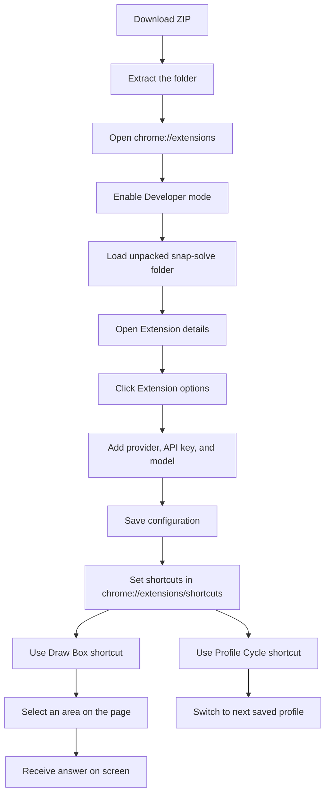

# SnapSolve

<!-- Intro demo GIF (hosted on Google Drive) -->

SnapSolve is a Manifest V3 Chrome extension that captures a selected region of the current page, sends the screenshot to your chosen AI provider, and shows a concise answer back on the page. It is built with plain JavaScript, HTML, and CSS, so there is no build step or package install required.

## Demo

A quick demo of SnapSolve in action (hosted on Google Drive):

  

### Setup video

Watch the setup video (hosted on Google Drive). Note: GitHub strips embedded iframes and external video tags, so the video is linked instead of embedded.

  

Direct links:

- Demo GIF: https://drive.google.com/file/d/1P3kIG8qMiwxL6e-_g4fAbugkMn6qII9O/view?usp=share_link
- Setup video: https://drive.google.com/file/d/1dSL7qNE7HEclVFh6wIxEX1KzZ7T0Hia6/view?usp=share_link

## What We Built

SnapSolve combines three pieces into one workflow:

- A screen selector overlay for drawing a box around the question you want to solve.
- A smart settings page for choosing a provider, loading live models, saving API keys, and managing profiles.
- A lightweight background service worker that captures the screen, crops the selection, sends it to the provider, and returns the result.

The extension includes:

- Dynamic model discovery with caching and fallback lists.
- Support for OpenAI-compatible providers, Anthropic, Google Gemini, Ollama, OpenRouter, NVIDIA NIM, Groq, and custom providers.
- Saved profiles so you can switch between provider/model combinations quickly.
- A shortcut to activate the draw box.
- A shortcut to cycle through saved profiles.
- In-page status messages, fallback toasts, and toolbar badge feedback.

## How It Works

1. You open the extension and select a region of the page.
2. SnapSolve captures the visible tab and crops only the selected box.
3. The background service worker sends the image to the configured AI provider.
4. The answer is displayed back in the extension card.
5. If you cycle profiles with a shortcut, the active provider/model changes instantly and the UI shows a confirmation.

## Setup Instructions

### 1. Download the extension

Download the project as a ZIP file and extract it somewhere on your computer.

### 2. Open Chrome extensions

In Chrome, go to:

- `chrome://extensions/`

Then enable:

- `Developer mode`

### 3. Load the unpacked extension

Click:

- `Load unpacked`

Then choose the extracted `snap-solve` folder that contains the `manifest.json` file.

### 4. Open the extension options

After the extension is loaded, open its `Details` page and click:

- `Extension options`

From there, configure:

- Provider
- Base URL, if your provider requires one
- API key
- Model
- Saved profile name is generated automatically from the provider and model

### 5. Save your profile

Click `Save Configuration` after entering the provider details. You can create multiple profiles and switch between them later.

### 6. Set keyboard shortcuts

Open Chrome’s shortcut manager:

- `chrome://extensions/shortcuts`

Set or confirm these shortcuts:

- Draw box / activate SnapSolve: `Ctrl+Shift+E` on Windows/Linux, `Cmd+Shift+E` on Mac
- Switch saved profile: `Ctrl+Shift+Y` on Windows/Linux, `Cmd+Shift+Y` on Mac

You can change either shortcut in Chrome if you want a different key combo.

## Mermaid Flow

## Default Shortcuts

- Activate the draw box: `Ctrl+Shift+E` / `Cmd+Shift+E`
- Cycle saved profiles: `Ctrl+Shift+Y` / `Cmd+Shift+Y`

## Supported Providers

SnapSolve is designed to work with providers that expose either OpenAI-compatible chat endpoints or provider-specific APIs. The settings page includes preset support for:

- OpenAI
- Anthropic
- Google Gemini
- NVIDIA NIM
- Ollama
- OpenRouter
- Groq
- Custom / Other

## Project Structure

- `snap-solve/manifest.json` - extension manifest and commands
- `snap-solve/background.js` - screen capture, API routing, and notification handling
- `snap-solve/content.js` - selection overlay, UI card, profile cycling, and response display
- `snap-solve/content.css` - in-page UI styling
- `snap-solve/settings/settings.html` - settings UI
- `snap-solve/settings/settings.js` - settings logic, model discovery, and profile storage
- `snap-solve/icons/` - packaged extension icons

## Notes

- There is no build command. The extension runs directly from source.
- Chrome may require you to customize shortcuts manually if the suggested key is already in use.
- If a provider does not return models automatically, you can still use a custom model entry.
- On some pages, Chrome restricts content scripts. In those cases, reload the tab or open a normal webpage.

## License

No license file is included yet. Add one if you plan to publish or share the extension publicly.
